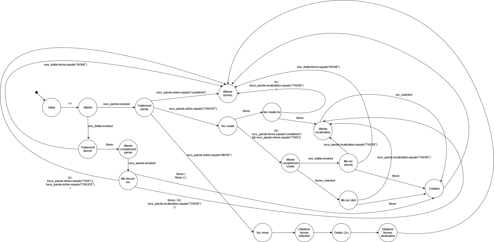

# multimodal_interaction

## Comment lancer le projet
Ce projet est pour Windows

Naviguez dans le dossier Palette et ouvrez l'application `palette.pde` avec [Processing](https://processing.org/) 

Depuis le répertoire `sra5` lancer l'application de reconnaissande de parole SRA5 : `sra5_on.bat`

Depuis le répertoire `OneDollarIvy` lancez `OneDollarIvy.exe` pour avoir l'application de dessin.
Pour l'utiliser, appuyez sur "i" pour charger la base de données, vous pouvez maintenant dessiner des formes.

Pour plus d'information lisez le rapport *... .pdf*.


## Utilisation de l'application

Appuyez sur "t" dans l'application Palette, vous pouvez énoncer une commande comme : 
```
créer un triangle rouge ici
```
en pointant l'endroit avec votre souris.

Des exemples de commande possible sont listées ci-dessous :
```
déplacer ça ici
``` 
En pointant la forme à déplacer puis en pointant la nouvelle position (la forme est dépalcé a l'endroit pointé par la souris après 2 secondes)

```
supprimer ça
```
En pointant la forme à supprimer.

## Fonctionnement

La machine à état du système est représenté si dessous : <br />
